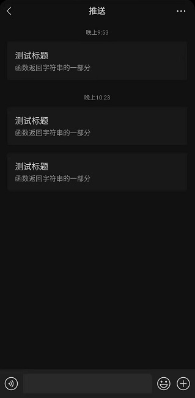

# 仿Server酱写的企业微信插件推送服务


​																										**りかちゃんかぁいいーお持ち帰りー**

## 原因

1.因为微信发布公告将在4月底下线模板消息，Server酱将在4月下线并迁移到Turbo版,然后......<br>2.自己刚好有服务器资源<br>3.企业微信应用消息的推送通道准入门槛比较低,装个插件就可以在微信中直接收到消息,并且内容模板管控得比较宽松,刚好符合我的要求<br>4.<del>数据掌握在自己的手里总比掌握在别人手里好吧</del><br>5.没有那么多原因了<br>

连夜花了两三个钟头写完测试并上线,功能还比较简单,个人用已经够了,后续再慢慢完善吧

## 食用方法

**注意:你必须要有自己的php服务器,并且服务器要装有Redis才可以正常使用本程序**

1. 申请你的企业微信账户,并且申请自己的应用(具体步骤可以看server酱的企业微信应用消息推送通道的说明)<br>
2. 上传src目录里面的文件到你的服务器,剩下随意<br>
3. 用编辑软件打开config.php,按照文件说明配置你的服务器信息<br>
### 配置项说明
| 配置项 |   说明   |   备注   |
| ---- | ---- | ---- |
|  $CORPID  |   企业ID   |   https://open.work.weixin.qq.com/api/doc/90000/90135/90665#corpid   |
|   CORPSECRET   |  应用Secret    |   https://open.work.weixin.qq.com/api/doc/90000/90135/90665#secret   |
|   AGENTID   |   应用ID   | https://open.work.weixin.qq.com/api/doc/90000/90135/90665#agentid |
|   COLL_BACK_URL   |   回调URL   |   固定格式:`https://127.0.0.1/push/?type=body&hash=` 只需要替换127.0.0.1为你的域名即可   |
|   SEND_KEY   |   接口请求密钥   |  接口请求密钥,可以留空,配置了则需要在参数带上sendKey    |
|   DESP_SIZE   |   消息正文长度   |   显示在卡片的消息正文长度,不建议过长   |
|   SMS_CACHE_TIME   |   消息缓存时间   |   消息在Redis缓存的时间   |

## 调用方式:

向index发送一个GET/POST请求，并传递参数即可。
消息编码为UTF-8,为了避免乱码,建议参数进行urlencode再传递

|   参数   |   说明   |
| ---- | ---- |
|   title   |   消息标题,无长度限制,但不建议过长   |
|   desp   |   消息内容,无长度限制,支持`<p><b><br><span><div>`标签,卡片显示长度受DESP_SIZE限制   |
|   sendKey   |   请求密钥,与配置项的SEND_KEY相同,可以不传递   |


```php
function sct_send($title = '', $desp = '', $sendKey = '')
    {
        $postdata = http_build_query( array( 'title' => $title, 'desp' => $desp, 'sendKey' => $sendKey));
        $opts = array('http' =>
        array(
            'method'  => 'POST',
            'header'  => 'Content-type: application/x-www-form-urlencoded',
            'content' => $postdata));
    	$context  = stream_context_create($opts);
    	return $result = file_get_contents('https://127.0.0.1/push/index.php', false, $context);
    } 
```

## // todo:
	后续写个用Sqlite做缓存的版本

## 效果




